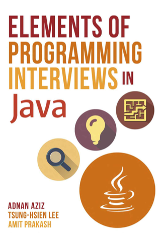

# elements-of-programming-interviews
Note of reading book - Elements of Programming Interviews in Java

## Section II: Problems

### [Primitive Types](./problems/primitive_types/ch4.md)

#### Concrete Problems

[Computing the Parity of a Word](./problems/primitive_types/ComputingParityOfWord.java)

[Swap Bits](./problems/primitive_types/SwapBits.java)

[Reverse Bits](./problems/primitive_types/ReverseBits.java)

[Find a Close Integer with the Same Weight](./problems/primitive_types/FindCloseIntegerWithSameWeight.java)
